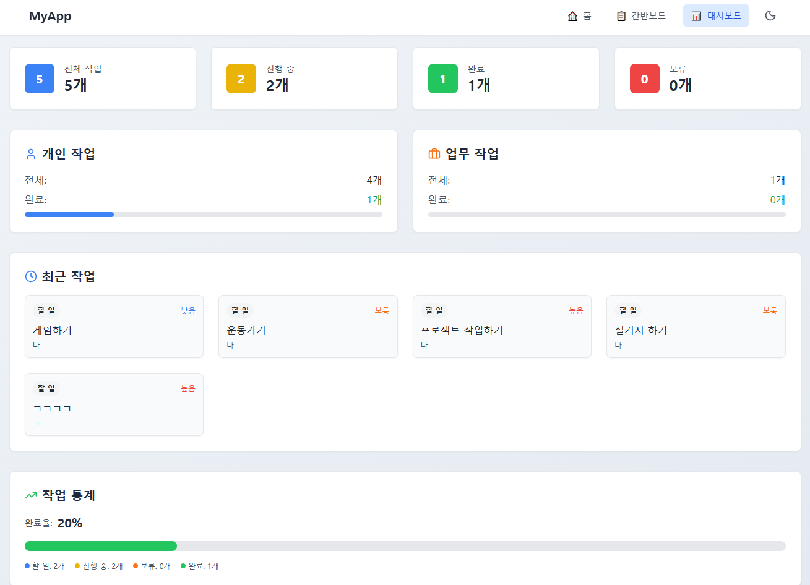

# 📋 My Kanban Board

ict_goorm 풀스택 교육 과정 중 개인 프로젝트 입니다.
React + TypeScript + TailwindCSS로 제작한 개인용 **칸반 보드(Kanban Board)** 웹 애플리케이션입니다.  
할 일을 시각적으로 관리하고, 드래그 앤 드롭으로 상태를 쉽게 변경할 수 있습니다.

---

## 🚀 주요 기능

- 🔄 **드래그 앤 드롭**으로 칼럼 간 카드 이동
- 📝 카드 내용 추가 / 수정 / 삭제
- 🎨 **다크 / 라이트 테마 전환**
- 🗂️ 개인용 / 업무용 작업 모드 전환
- 📊 대시보드에서 작업 통계 확인
- 💾 LocalStorage 기반 데이터 저장

---

## 🛠 기술 스택

- **프론트엔드**: [React 19](https://react.dev/), [TypeScript](https://www.typescriptlang.org/)
- **스타일링**: [Tailwind CSS](https://tailwindcss.com/)
- **빌드 툴**: [Vite](https://vitejs.dev/)
- **아이콘**: [lucide-react](https://lucide.dev/)

---

## 📂 폴더 구조

```plaintext
src/
├── assets/                  # 이미지, 폰트 등 정적 리소스
├── components/              # 재사용 가능한 UI 컴포넌트
│   ├── ActivityLog.tsx
│   ├── KanbanColumn.tsx
│   ├── Layout.tsx
│   ├── TaskCard.tsx
│   ├── TaskDetailModal.tsx
│   └── TaskForm.tsx
├── hooks/                   # 커스텀 훅
│   ├── useDragAndDrop.ts
│   ├── useLocalStorage.ts
│   ├── useTheme.ts
│   └── useWorkMode.ts
├── pages/                   # 페이지 단위 컴포넌트
│   ├── Dashboard.tsx
│   ├── Home.tsx
│   └── KanbanBoard.tsx
├── types/                   # 타입 정의
│   └── types.ts
├── utils/                   # 유틸 함수
│   ├── taskUtils.ts
│   └── uiUtils.ts
├── App.css
├── App.tsx
├── index.css
├── main.tsx                  # 앱 진입점
└── vite-env.d.ts
```

## 💻 설치 및 실행 방법

```
# 1. 저장소 클론

git clone https://github.com/username/my-kanban-board.git

# 2. 패키지 설치

npm install

# 3. 개발 서버 실행

npm run dev

# 4. 프로덕션 빌드

npm run build

```

## 🖼 실행 화면

📌 칸반 보드

📊 대시보드


📅 향후 계획
[] 카드 검색 기능 추가
[] 칼럼 순서 변경 기능
[] 백엔드 연동 및 로그인 기능

📜 라이선스
이 프로젝트는 MIT 라이선스를 따릅니다.
